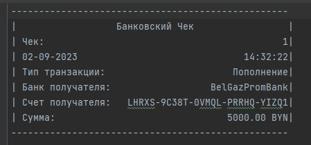

Консольное приложение для Clever-Bank.

Описание: консольное приложение для сотрудников банка, в котором можно осуществлять операции по обслуживанию Клиентов банка.

Запуск приложения: 
1. запустить docker для работы с базой данных 
   в командной строке в папке, где находится файл docker-compose.yml запустить команду docker-compose up -d
   
2. запустить в классе App метод main().

После запуска приложения должны автоматически создаться таблицы в БД и заполниться данными.
   
   
Также в консоли выведется Главное Меню для работы.
   
При вводе 1 переходим в Меня операций над Банками.
   
При вводе 2 переходим в Меня операций над Клиентами.
   
При вводе 3 переходим в Меня операций над Счетами.
   

Данное приложение работает с консолью, поэтому необходимо выбирать пункт того, что хотим сделать и дальше вводить в консоль, запрашиваемую приложением информацию.

Например, мы хотим добавить новый банк. Войдем в Меня операций над банками, выберем пункт "добавление банка" и введем наименование банка. Новый банк создан.
   
   
Создадим нового Клиента. Войдем в Меня операций над клиентами, выберем пункт "добавление клиента" и введем Имя, Отчество, Фамилию и Адрес Клиента. Новый клиент создан.
   
   
После создания Клиента необходимо его добавить в Банк.
   
   
Создадим новый счет. Войдем в Меню операций над Счетами. Введем пункт "добавление счета", введем id клиента и id банка и счет открыт.
   
Пополним данный счет на 5000 BYN.
   
Также будет сформирован Банковский счет на данную операцию.
   
Переведем 1000 BYN Михайловне Александре Никитичне.
   
   
Сделаем перевод денег от Богданова Михаила Яковлевича - на счет Иванова Ивана Ивановича в размере 500 BYN.
   
   
Снимем 2000 BYN со счет Иванова Ивана Ивановича.
   
   
Автоматически по расписанию в последний день месяца будет начислен 1% дохода на остаток денежных средств на счету. В образце (для отображения данного функционала проценты были начислены 02.09).
   
Сформируем выписку по счету Иванова Ивана Ивановича за 02.09.2023
   

При проведении банковских операций происходит проверка существует ли данный Счет, наличия достаточного количество денег для операции и не ввел ли пользователь отрицательное число.
   
   
   

Таким образом данное консольное приложение позволяет выполнять CRUD операции над Банками, Клиентами и Счетами.
Позволяет осуществлять Пополнение Счета, Перевод Денег на другие Счета, Снятие денег, а также автоматическое начисление процентов раз в месяц на остаток денежных средств на счету.
После каждой операции происходит формирование подтверждающего документа об операции.
Также имеется возможность формировать выписку по счету об всех операциях за определенный период времени.

